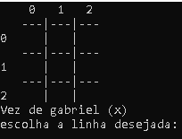

<h1 align= "center"> # Jogo Da Velha # </h1>

     Jogo desenvolvido como projeto do semestre da materia praticas integredas: materiais de engenharia

<h2> 📝Como Jogar: </h2>
<ul>
    <li> escolha a opçao jogar e logo em seguida o nome dos 2 jogadores</li>
    <li> ao começar o jogo o console mostrara de quem é o turno e qual o simbolo que representa o msm( X || O).</li>
    <li> Logo ao começar escolham alternadamente cada um uma linha e uma coluna e o sistema marcara automaticamente</li>
    <li> lembrem-se de se divertir😀</li>